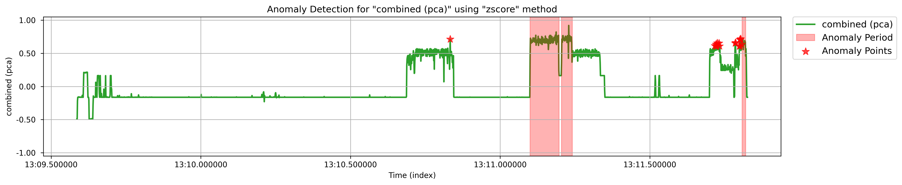

# TMLL

**T**race-Server **M**achine **L**earning **L**ibrary (TMLL) is an automated pipeline that aims to apply Machine Learning techniques to the analyses derived from [Trace Server](https://github.com/eclipse-cdt-cloud/trace-server-protocol). TMLL aims to simplify the process of performing both primitive trace analyses and complementary ML-based investigations.

TMLL provides users with pre-built, automated solutions integrating general Trace-Server analyses (e.g., CPU, Memory, or Disk usage) with machine learning techniques. This allows for more precise, efficient analysis without requiring deep knowledge in either Trace-Server operations or machine learning. By streamlining the workflow, TMLL empowers users to identify anomalies, trends, and other performance insights without extensive technical expertise, significantly improving the usability of trace data in real-world applications.

### Features and Modules

In a nutshell, TMLL employs a diverse set of machine learning techniques, ranging from straightforward statistical tests to more sophisticated model-training procedures, to provide insights from analyses driven by Trace Server. These features are designed to help users reduce their manual efforts by automating the trace analysis process.



#### Anomaly Detection

Irregularities in system behavior can disrupt operations, often without immediate visibility. The Anomaly Detection module serves as a watchful observer, meticulously analyzing time-series data to detect deviations from expected patterns. It highlights anomalies with precision, enabling you to address them proactively and maintain smooth system functionality.

```python
from tmll.ml.modules.anomaly_detection.anomaly_detection_module import AnomalyDetection

# Initialize the module
ad = AnomalyDetection(client, experiment, outputs) # Check the Quickstart page to see what are these variables

# Find anomalies using a custom method and parameters
anomalies = ad.find_anomalies(method='zscore', zscore_threshold=3)

# Plot the anomalies
ad.plot_anomalies(anomalies, plot_size=(15,8))
```

<figure><figcaption></figcaption></figure>

***

#### Memory Leak Detection

Memory leaks can quietly deplete a system's resources, leading to inefficiencies and potential instability.  TMLL delves into the intricacies of memory usage, analyzing allocation patterns and pinpointing areas of concern. By identifying potential leaks and computing critical metrics, it acts as a vigilant safeguard, ensuring your system maintains optimal performance.

```python
from tmll.ml.modules.anomaly_detection.memory_leak_detection_module import MemoryLeakDetection

# Initialize the module
mld = MemoryLeakDetection(client, experiment) # Check the Quickstart page to see what are these variables

# Find the memory leaks
leaks = mld.analyze_memory_leaks()

# Plot the memory leaks
mld.plot_memory_leaks_analysis(leaks)
```

<figure><figcaption></figcaption></figure>



#### Correlation Analysis

System metrics, such as CPU or Memory usage, often interact in ways that can be complex and nuanced. Here, TMLL examines these interdependencies, revealing how changes in one metric influence others. By providing a deeper understanding of these relationships, it facilitates informed decision-making and system optimization.

```python
from tmll.ml.modules.root_cause.correlation_module import CorrelationAnalysis

# Initialize the module
ca = CorrelationAnalysis(client, experiment, outputs) # Check the Quickstart page to see what are these variables

# Analyze the correlations between components (e.g., CPU and Memory)
correlations = ca.analyze_correlations()

# Plot the correlation matrix
ca.plot_correlation_matrix(correlations)
```

<figure><figcaption></figcaption></figure>



#### Change Point Detection

Significant shifts in system performance often mark critical moments in operations. This module aims to identify these pivotal changes, analyzing trends to uncover their causes and implications. By mapping performance transformations, it provides the insight needed to adapt and refine system strategies effectively.

```python
from tmll.ml.modules.performance_trend.change_point_module import ChangePointAnalysis

# Initialize the module
cpa = ChangePointAnalysis(client, experiment, outputs) # Check the Quickstart page to see what are these variables

# Detect the significant change points in the system
change_points = cpa.get_change_points(n_change_points=2, methods=['voting', 'pca'])

# Plot the change points
cpa.plot_change_points(change_points)
```

<figure><figcaption></figcaption></figure>



#### Capacity Planning (Forecasting)

Anticipating future demands is essential for maintaining system resilience. TMLL evaluates historical trends to forecast resource requirements and identify potential bottlenecks. By providing actionable recommendations, it empowers you to allocate resources effectively, ensuring your system is prepared for growth and challenges.

```python
from tmll.ml.modules.predictive_maintenance.capacity_planning_module import CapacityPlanning

# Initialize the module
cp = CapacityPlanning(client, experiment, outputs) # Check the Quickstart page to see what are these variables

# Forecast the system's metrics
forecasts = cp.forecast_capacity(method='ARIMA', resource_types=['CPU', 'DISK'])

# Plot the forecasts along with the original data
cp.plot_capacity_forecast(forecasts)
```

<figure><figcaption></figcaption></figure>



#### Idle Resource Detection

Underutilized resources represent missed opportunities for efficiency. This module identifies periods of inactivity in system components, such as CPU cores and memory. It offers insights into optimizing resource usage, enabling you to enhance performance and make the most of your system's potential.

```python
from tmll.ml.modules.resource_optimization.idle_resource_detection_module import IdleResourceDetection

# Initialize the module
ird = IdleResourceDetection(client, experiment, outputs) # Check the Quickstart page to see what are these variables

# Determine idle resources (if any)
idle_resources = ird.analyze_idle_resources(resource_types=['CPU', 'MEMORY'], cpu_idle_threshold=30, memory_idle_threshold=10*1024*1024)

# Plot the resource utilization with their idle periods (if any)
ird.plot_resource_utilization(idle_resources)
```

<figure><figcaption></figcaption></figure>



