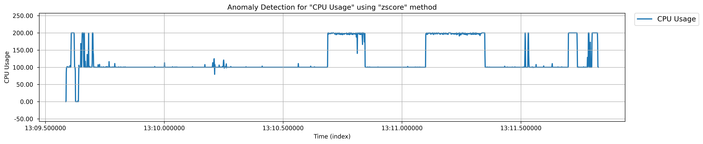
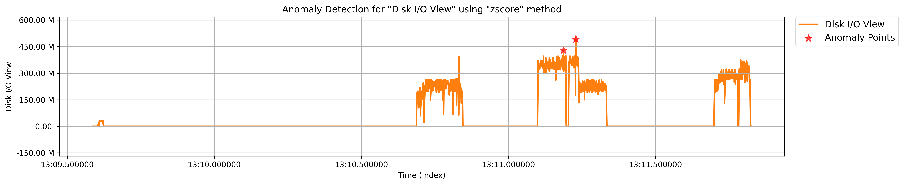
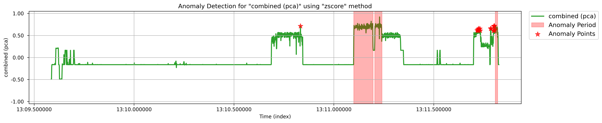
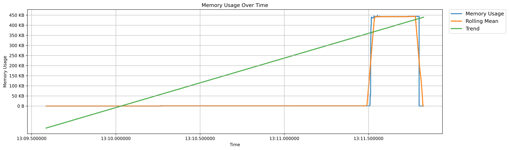
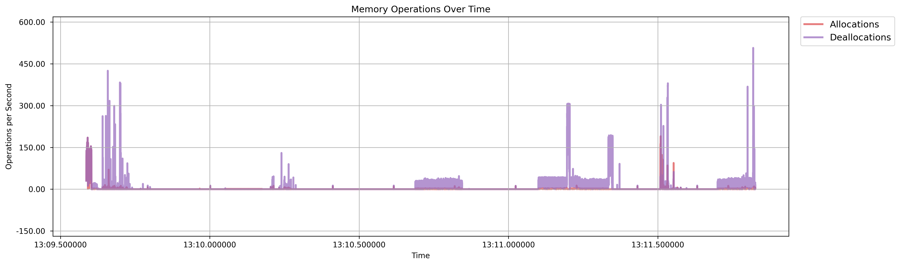
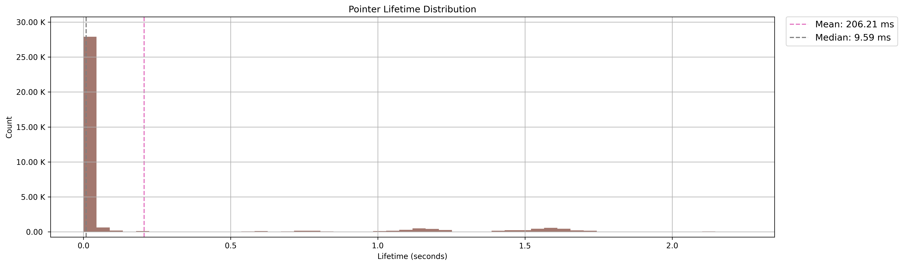
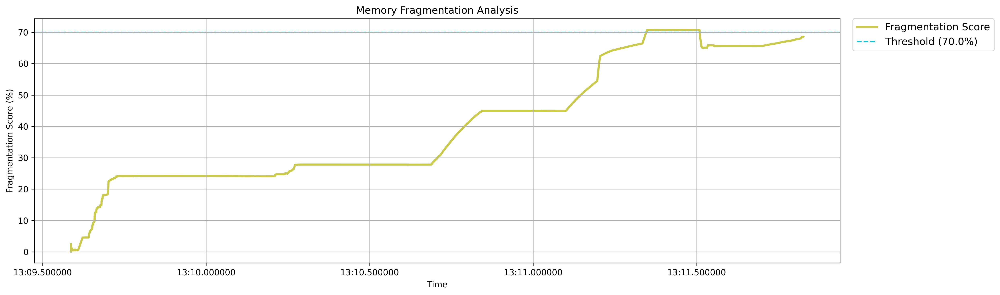
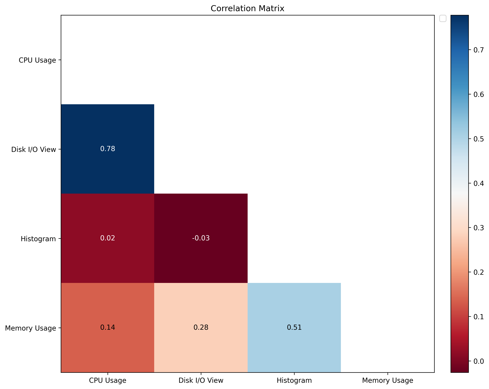
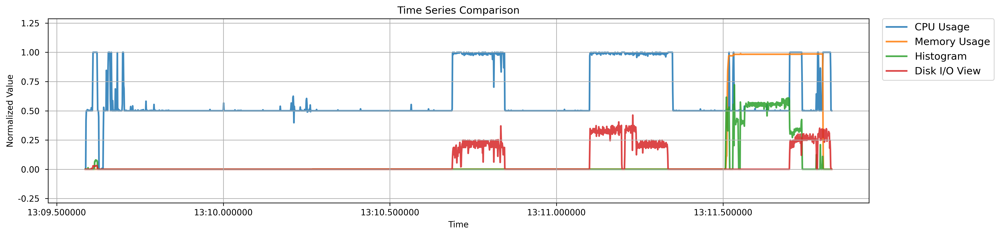
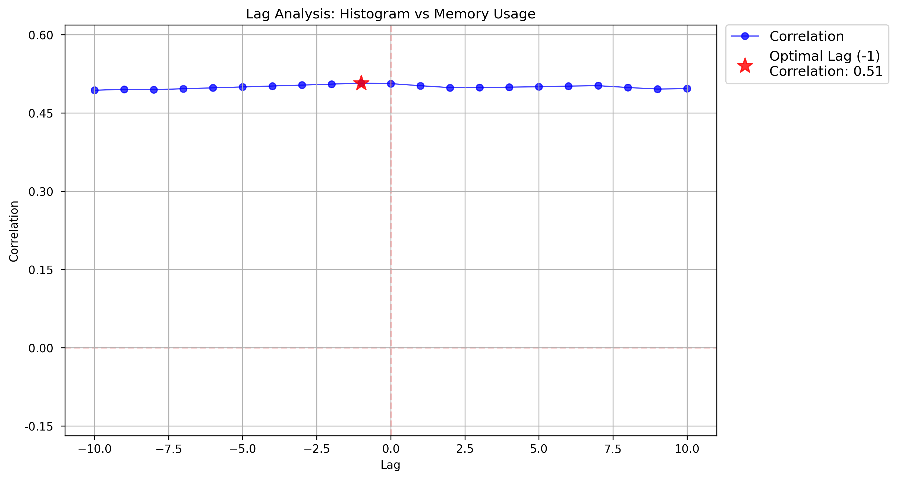

# Quickstart

## Initializing TMLL

### Installing Trace Server


TMLL includes a built-in feature to automatically download and install Trace Server on your machine. However, this functionality is currently available only for Linux and Windows platforms. If you're using one of these platforms, you can skip this section. Otherwise, you will need to manually download and run Trace Server.


As indicated, TMLL leverages the outputs derived by Trace Server. Hence, you need to have Trace Server installed and running on your machine while using TMLL. Using this link, you can download the appropriate version of Trace Server for your machine, once downloaded, run its executable.


By default, you can check the running status of Trace Server by visiting [http://localhost:8080/tsp/api/health](http://localhost:8080/tsp/api/health).


### Creating a TMLL Client

Before using any specific module, you must initialize a TMLL client. The client manages trace files, including importing them, creating experiments, fetching outputs, and performing other related tasks.

```python
from tmll.tmll_client import TMLLClient

# This client object will be used in the subsequent steps
client = TMLLClient(verbose=True)
```

### Importing Traces

The primary input for TMLL consists of trace files. Assuming you have already collected your trace files, importing them into the TMLL client is a simple process.

```python
# We create an experiment from the trace files. This experiment will be also used in the subsequent steps.
experiment = client.create_experiment(traces=[
    {
        "path": "/path/to/the/first/trace", # Required
        "name": "your_custom_name" # Optional. If absent, a random name would be assigned
    },
    {
        "path": "/path/to/the/second/trace"
    }
], experiment_name="EXPERIMENT_NAME")
```

From this point forward, we will pass the `client` and `experiment` objects to the modules we want to use. To clarify, the `client` is responsible for communicating with the Trace Server, while the `experiment` handles various trace outputs (e.g., CPU and memory usage, flame charts, graphs, etc.).

## Anomaly Detection

This group includes modules designed to identify abnormal data points (i.e., timestamps), with each module offering insights into anomalies from different perspectives.


TMLL does not guarantee that the identified data points are actual anomalies within the system, as it lacks access to the system's contextual information and cannot distinguish between normal and abnormal data points due to the unlabeled nature of trace files. Instead, TMLL uses statistical procedures and calculations to highlight data points that behave significantly differently from the rest, making them strong candidates for further investigation.


### Anomaly Detection

The goal is to identify data points or time periods that deviate significantly from the system's general behavior.

#### Initializing the Module

```python
# Import the module
from tmll.ml.modules.anomaly_detection.anomaly_detection_module import AnomalyDetection

# If you want to check all of the outputs that your experiment contains
for output in experiment.outputs:
  print(f'Name: {output.name}') # Name of the output (e.g., CPU Usage, Disk I/O View, etc.)
  print(f'Description: {output.description}') # Description of the output
  print(f'Type: {output.type}') # Type of the output (e.g., TREE_TIME_XY, TABLE, etc.)
  print(f'ID: {output.id}') # ID of the output

# Assuming your trace data already has information on "CPU Usage" and "Disk Usage"
outputs = experiment.find_outputs(keyword=['cpu usage', 'disk'], type=['xy'], match_any=True)

# Initialize the module
ad = AnomalyDetection(client=client, experiment=experiment, outputs=outputs, # Required params
                      resample=True, resample_freq='100ms') # Optional params (Check the API documentation to see the list of them)
```

#### Finding Anomalies

Currently, TMLL supports the following methods to pinpoint anomalies in the trace data:

* **zscore**: Identifies anomalies based on how many standard deviations a data point is from the mean.

```python
anomalies = ad.find_anomalies(method='zscore', zscore_threshold=3.5)
```

* **iqr**: Detects anomalies by finding data points that lie outside the interquartile range (IQR).

```python
anomalies = ad.find_anomalies(method='iqr')
```

* **moving\_average**: Flags anomalies based on deviations from a smoothed average over a moving window.

```python
anomalies = ad.find_anomalies(method='moving_average',
                              moving_average_window_size=10,
                              moving_average_threshold=3)
```

* **combined**: The combination of _zscore_, _iqr_, and _moving\_average._ It will provide more robust detection results, but omit some data points that don't belong in some methods.

```python
anomalies = ad.find_anomalies(method='combined',
                              moving_average_threshold=2,
                              zscore_threshold=3)
```

* **iforest**: Uses the Isolation Forest algorithm to isolate and identify anomalous data points.

```python
anomalies = ad.find_anomalies(method='iforest',
                              iforest_window_size=100,
                              iforest_contamination=0.1,
                              iforest_random_state=42)
```

* **seasonality**: Detects anomalies by identifying deviations from expected seasonal patterns in the data. This should mostly be used for seasonal data, such as the systems' periodic tasks.

```python
anomalies = ad.find_anomalies(method='seasonality',
                              seasonality_seasonal_period=10,
                              seasonality_arima_order=(1,2,1),
                              seasonality_seasonal_order=(1,1,1),
                              seasonality_confidence_level=0.05)
```

#### Plotting the Results

Assuming the anomaly detection module is initialized with _CPU_ and _Disk_ usage data, and the methodology is set to _z-score (threshold = 2)_, anomalies can be visualized using the `plot_anomalies` method.

```python
ad.plot_anomalies(anomalies, fig_size=(15,4), fig_dpi=300)
```

<figure><figcaption><p>CPU usage over time. As visible, no <em>significant</em> anomalies were detected via <em>zscore (threshold =2)</em> method.</p></figcaption></figure>

<figure><figcaption><p>Disk usage over time. Two anomaly points were identified for this resource.</p></figcaption></figure>

<figure><figcaption><p>The combination of CPU and disk usage (analyzed using PCA) over time revealed three significant anomaly periods (consistent anomaly points within specific time intervals) and several isolated anomaly points.</p></figcaption></figure>

### Memory Leak Detection

Poor memory management strategies can lead to memory leaks, causing significant damage to the system as the program runs for extended periods. This module focuses on identifying and highlighting issues such as unfreed allocated memory pointers or steadily increasing memory usage for the user.

#### Initializing the Module

```python
# Import the module
from tmll.ml.modules.anomaly_detection.memory_leak_detection_module import MemoryLeakDetection

# Initialize the module
# Here, we don't need custom outputs, as the module automatically fetches the proper outputs of memory analysis
mld = MemoryLeakDetection(client=client, experiment=experiment)
```

#### Indicating the Memory Leaks

```python
mem_leaks = mld.analyze_memory_leaks(window_size='1s', # The window size for trend analysis
                                     fragmentation_threshold=0.70, # The threshold for memory fragmentation (%)
                                     slope_threshold=0.5) # The threshold for memory growth slope (linear regression)
```

#### Plotting the Results

```python
mld.plot_memory_leak_analysis(mem_leaks)
```

<figure><figcaption><p>Memory usage over time is displayed alongside a trend line derived from a linear regression model.</p></figcaption></figure>

<figure><figcaption><p>Memory operations over time, illustrating the number of allocation and deallocation operations performed.</p></figcaption></figure>

<figure><figcaption><p>A bar plot displaying the lifetime of memory pointers over time.</p></figcaption></figure>

<figure><figcaption><p>The fragmentation score (in %) of the memory as program executes.</p></figcaption></figure>

#### Interpreting the Results

Interpreting the analysis results from this module can be challenging for users who are not experts in analyzing memory behaviors and indicators. To assist users, TMLL offers an interpretation method that provides detailed analysis results, recommendations, and insights.

```python
mld.interpret(mem_leaks)
```

```
╭──────────────────────────────────────────────────────────────────────────────╮
│                                                                              │
│                         Memory Leak Analysis Results                         │
│                                                                              │
╰──────────────────────────────────────────────────────────────────────────────╯
```

```
╭─ Analysis Overview ──────────────────────────────────────────────────────────╮
│                                                                              │
│ Severity        : MEDIUM                                                     │
│ Confidence Score: 1.00                                                       │
│                                                                              │
╰──────────────────────────────────────────────────────────────────────────────╯
```

```
╭─ Memory Metrics ─────────────────────────────────────────────────────────────╮
│                                                                              │
│ Unreleased Allocations : 3609                                                │
│ Total Allocations      : 37707                                               │
│ Leak Rate              : 0.54 B/s                                            │
│ Average Allocation Size: 149.85 B                                            │
│ Max Continuous Growth  : 1.24 s                                              │
│ Memory Fragmentation   : 9.61%                                               │
│                                                                              │
╰──────────────────────────────────────────────────────────────────────────────╯
```

```
╭─ Detected Patterns ──────────────────────────────────────────────────────────╮
│                                                                              │
│ 1: Systematic memory growth detected: 0.54 B/s                               │
│ 2: Irregular allocation pattern detected                                     │
│                                                                              │
╰──────────────────────────────────────────────────────────────────────────────╯
```

```
                           Top 5 Suspicious Locations                           
╭───────────────────┬───────────┬────────────────────┬─────────────────────────╮
│                   │           │                    │                         │
│ Pointer           │Size       │Allocation Count    │Event Context            │
├───────────────────┼───────────┼────────────────────┼─────────────────────────┤
│                   │           │                    │                         │
│ 0x5629b645f860    │32.00 KB   │1                   │lttng_ust_libc:malloc    │
│                   │           │                    │                         │
│ 0x5629b6432100    │32.00 KB   │1                   │lttng_ust_libc:malloc    │
│                   │           │                    │                         │
│ 0x5629b6495590    │32.00 KB   │1                   │lttng_ust_libc:malloc    │
│                   │           │                    │                         │
│ 0x5629b6419030    │32.00 KB   │1                   │lttng_ust_libc:malloc    │
│                   │           │                    │                         │
│ 0x5629b644c4c0    │32.00 KB   │1                   │lttng_ust_libc:malloc    │
│                   │           │                    │                         │
╰───────────────────┴───────────┴────────────────────┴─────────────────────────╯
```

```
╭─ Memory Usage Statistics ────────────────────────────────────────────────────╮
│                                                                              │
│ Peak Memory Usage   : 626.10 KB                                              │
│ Average Memory Usage: 79.55 KB                                               │
│ Memory Usage Std Dev: 205.31 KB                                              │
│                                                                              │
╰──────────────────────────────────────────────────────────────────────────────╯
```

```
╭─ Allocation Statistics ──────────────────────────────────────────────────────╮
│                                                                              │
│ Total Allocations    : 37,707                                                │
│ Total Deallocations  : 202,468                                               │
│ Unmatched Allocations: 3,609                                                 │
│                                                                              │
╰──────────────────────────────────────────────────────────────────────────────╯
```

```
╭─ Pointer Lifetime Statistics ────────────────────────────────────────────────╮
│                                                                              │
│ Average Lifetime: 206.21 ms                                                  │
│ Median Lifetime : 9.59 ms                                                    │
│ Maximum Lifetime: 2.24 s                                                     │
│                                                                              │
╰──────────────────────────────────────────────────────────────────────────────╯
```

## Root Cause Analysis

In the event of unexpected behaviors, the modules in this group can assist in identifying their root causes. This allows you to understand the causality and correlation between system components and their behavior over time.

### Correlation Analysis

System components often influence each other's behavior, creating a chain of interdependent actions. For example, a CPU spike at a specific timestamp might result from a particular disk activity operation. This module enables you to analyze and understand the correlations between system components.

#### Initializing the Module

```python
# Import the module
from tmll.ml.modules.root_cause.correlation_analysis_module import CorrelationAnalysis

# Get the outputs of CPU, Memory, Disk usage, and Histogram (i.e., number of events in each timestamp)
outputs = experiment.find_outputs(keyword=['cpu usage', 'memory usage', 'disk', 'histogram'], type=['xy'], match_any=True)

# Initialize the module
ca = CorrelationAnalysis(client, experiment, outputs)
```

#### Finding the Correlations

TMLL automatically selects an appropriate correlation methodology (e.g., Pearson, Spearman, or Kendall) based on the characteristics of the data distributions. This allows you to determine the correlation for each pair of system components according to their specific attributes.

```python
# Analyze the correlations
correlations = ca.analyze_correlations()

# You may also indicate specific start/end times to
# analyze the correlations only during that period
correlations = ca.analyze_correlations(start_time=pd.Timestamp("2025-01-01 18:00:00"),
                                       end_time=pd.Timestamp("2025-01-01 18:30:00"))
```

#### Plotting the Correlation Matrix

```
ca.plot_correlation_matrix(correlations)
```

<figure><figcaption><p>The correlation matrix for various metrics over the entire trace period shows that CPU and disk usage have a high positive correlation, memory usage and histogram exhibit a moderate positive correlation, and the remaining components have minimal impact on each other.</p></figcaption></figure>

You can also generate a time-series plot comparison for the metrics to observe their behaviors over time.

```python
ca.plot_time_series(series=["CPU Usage", "Memory Usage", "Histogram", "Disk I/O View"])
```

<figure><figcaption><p>Time-series plot for different system components over time.</p></figcaption></figure>

#### Correlation Lag Analysis

The impact of different system components may occur with a delay, resembling a chain of actions where one component influences another step by step. For example, a spike in CPU usage might lead to an increase in memory usage after a short delay, rather than both events occurring simultaneously. TMLL provides an option to identify the lag between each component.

```python
lag_analysis = ca.analyze_lags(series1_name="Histogram", series2_name="Memory Usage", max_lag=10)
```

<figure><figcaption><p>The lag analysis between the histogram (number of events at each timestamp) and memory usage indicates a lag of -1 (or +1 when comparing memory usage to the histogram). This suggests a one-unit timestamp difference in the impact of one component on the other.</p></figcaption></figure>
