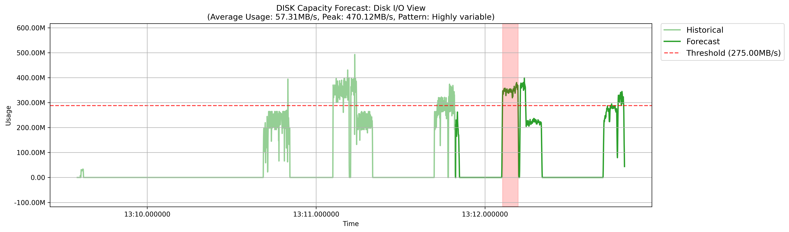

# Quickstart

## Initializing TMLL

### Installing Trace Server


TMLL includes a built-in feature to automatically download and install Trace Server on your machine. However, this functionality is currently available only for Linux and Windows platforms. If you're using one of these platforms, you can skip this section. Otherwise, you will need to manually download and run Trace Server.


As indicated, TMLL leverages the outputs derived by Trace Server. Hence, you need to have Trace Server installed and running on your machine while using TMLL. Using this link, you can download the appropriate version of Trace Server for your machine, once downloaded, run its executable.


By default, you can check the running status of Trace Server by visiting [http://localhost:8080/tsp/api/health](http://localhost:8080/tsp/api/health).


### Creating a TMLL Client

Before using any specific module, you must initialize a TMLL client. The client manages trace files, including importing them, creating experiments, fetching outputs, and performing other related tasks.

```python
from tmll.tmll_client import TMLLClient

# This client object will be used in the subsequent steps
client = TMLLClient(verbose=True)
```

### Importing Traces

The primary input for TMLL consists of trace files. Assuming you have already collected your trace files, importing them into the TMLL client is a simple process.

```python
# We create an experiment from the trace files. This experiment will be also used in the subsequent steps.
experiment = client.create_experiment(traces=[
    {
        "path": "/path/to/the/first/trace", # Required
        "name": "your_custom_name" # Optional. If absent, a default name would be assigned
    },
    {
        "path": "/path/to/the/second/trace"
    }
], experiment_name="EXPERIMENT_NAME")
```

From this point forward, we will pass the `client` and `experiment` objects to the modules we want to use. To clarify, the `client` is responsible for communicating with the Trace Server, while the `experiment` handles various trace outputs (e.g., CPU and memory usage, flame charts, graphs, etc.).

## [Anomaly Detection](#user-content-fn-1)[^1]

This group includes modules designed to identify abnormal data points (i.e., timestamps), with each module offering insights into anomalies from different perspectives.


TMLL does not guarantee that the identified data points are actual anomalies within the system, as it lacks access to the system's contextual information and cannot distinguish between normal and abnormal data points due to the unlabeled nature of trace files. Instead, TMLL uses statistical procedures and calculations to highlight data points that behave significantly differently from the rest, making them strong candidates for further investigation.


### [Anomaly Detection](#user-content-fn-2)[^2]

The goal is to identify data points or time periods that deviate significantly from the system's general behavior.

#### Initializing the Module

```python
# Import the module
from tmll.ml.modules.anomaly_detection.anomaly_detection_module import AnomalyDetection

# If you want to check all of the outputs that your experiment contains
for output in experiment.outputs:
  print(f'Name: {output.name}') # Name of the output (e.g., CPU Usage, Disk I/O View, etc.)
  print(f'Description: {output.description}') # Description of the output
  print(f'Type: {output.type}') # Type of the output (e.g., TREE_TIME_XY, TABLE, etc.)
  print(f'ID: {output.id}') # ID of the output

# Assuming your trace data already has information on "CPU Usage" and "Disk Usage"
outputs = experiment.find_outputs(keyword=['cpu usage', 'disk'], type=['xy'], match_any=True)

# Initialize the module
ad = AnomalyDetection(client=client, experiment=experiment, outputs=outputs, # Required params
                      resample=True, resample_freq='100ms') # Optional params (Check the API documentation to see the list of them)
```

#### Finding Anomalies

Currently, TMLL supports the following methods to pinpoint anomalies in the trace data:

* [**zscore**](#user-content-fn-3)[^3]: Identifies anomalies based on how many standard deviations a data point is from the mean.

```python
anomalies = ad.find_anomalies(method='zscore', zscore_threshold=3.5)
```

* [**iqr**](#user-content-fn-4)[^4]: Detects anomalies by finding data points that lie outside the interquartile range (IQR).

```python
anomalies = ad.find_anomalies(method='iqr')
```

* [**moving\_average**](#user-content-fn-5)[^5]: Flags anomalies based on deviations from a smoothed average over a moving window.

```python
anomalies = ad.find_anomalies(method='moving_average',
                              moving_average_window_size=10,
                              moving_average_threshold=3)
```

* **combined**: The combination of _zscore_, _iqr_, and _moving\_average._ It will provide more robust detection results, but omit some data points that don't belong in some methods.

```python
anomalies = ad.find_anomalies(method='combined',
                              moving_average_threshold=2,
                              zscore_threshold=3)
```

* [**iforest**](#user-content-fn-6)[^6]: Uses the Isolation Forest algorithm to isolate and identify anomalous data points.

```python
anomalies = ad.find_anomalies(method='iforest',
                              iforest_window_size=100,
                              iforest_contamination=0.1,
                              iforest_random_state=42)
```

* [**seasonality**](#user-content-fn-7)[^7]: Detects anomalies by identifying deviations from expected seasonal patterns in the data. This should mostly be used for seasonal data, such as the systems' periodic tasks.

```python
anomalies = ad.find_anomalies(method='seasonality',
                              seasonality_seasonal_period=10,
                              seasonality_arima_order=(1,2,1),
                              seasonality_seasonal_order=(1,1,1),
                              seasonality_confidence_level=0.05)
```

#### Plotting the Results

Assuming the anomaly detection module is initialized with _CPU_ and _Disk_ usage data, and the methodology is set to _z-score (threshold = 2)_, anomalies can be visualized using the `plot_anomalies` method.

```python
ad.plot_anomalies(anomalies, fig_size=(15,4), fig_dpi=300)
```

<figure><figcaption><p>CPU usage over time. As visible, no <em>significant</em> anomalies were detected via <em>zscore (threshold =2)</em> method.</p></figcaption></figure>

<figure><figcaption><p>Disk usage over time. Two anomaly points were identified for this resource.</p></figcaption></figure>

<figure><figcaption><p>The combination of CPU and disk usage (analyzed using PCA) over time revealed three significant anomaly periods (consistent anomaly points within specific time intervals) and several isolated anomaly points.</p></figcaption></figure>

### [Memory Leak Detection](#user-content-fn-8)[^8]

Poor memory management strategies can lead to memory leaks, causing significant damage to the system as the program runs for extended periods. This module focuses on identifying and highlighting issues such as unfreed allocated memory pointers or steadily increasing memory usage for the user.

#### Initializing the Module

```python
# Import the module
from tmll.ml.modules.anomaly_detection.memory_leak_detection_module import MemoryLeakDetection

# Initialize the module
# Here, we don't need custom outputs, as the module automatically fetches the proper outputs of memory analysis
mld = MemoryLeakDetection(client=client, experiment=experiment)
```

#### Indicating the Memory Leaks

<pre class="language-python"><code class="lang-python">mem_leaks = mld.analyze_memory_leaks(window_size='1s', # The window size for trend analysis
                                     fragmentation_threshold=0.70, # The threshold for memory <a data-footnote-ref href="#user-content-fn-9">fragmentation</a> (%)
                                     slope_threshold=0.5) # The threshold for memory growth slope (linear regression)
</code></pre>

#### Plotting the Results

```python
mld.plot_memory_leak_analysis(mem_leaks)
```

<figure><figcaption><p>Memory usage over time is displayed alongside a trend line derived from a linear regression model.</p></figcaption></figure>

<figure><figcaption><p>Memory operations over time, illustrating the number of allocation and deallocation operations performed.</p></figcaption></figure>

<figure><figcaption><p>A bar plot displaying the lifetime of memory pointers over time.</p></figcaption></figure>

<figure><figcaption><p>The fragmentation score (in %) of the memory as program executes.</p></figcaption></figure>

#### Interpreting the Results

Interpreting the analysis results from this module can be challenging for users who are not experts in analyzing memory behaviors and indicators. To assist users, TMLL offers an interpretation method that provides detailed analysis results, recommendations, and insights.

```python
mld.interpret(mem_leaks)
```

```
╭──────────────────────────────────────────────────────────────────────────────╮
│                                                                              │
│                         Memory Leak Analysis Results                         │
│                                                                              │
╰──────────────────────────────────────────────────────────────────────────────╯
```

```
╭─ Analysis Overview ──────────────────────────────────────────────────────────╮
│                                                                              │
│ Severity        : MEDIUM                                                     │
│ Confidence Score: 1.00                                                       │
│                                                                              │
╰──────────────────────────────────────────────────────────────────────────────╯
```

```
╭─ Memory Metrics ─────────────────────────────────────────────────────────────╮
│                                                                              │
│ Unreleased Allocations : 3609                                                │
│ Total Allocations      : 37707                                               │
│ Leak Rate              : 0.54 B/s                                            │
│ Average Allocation Size: 149.85 B                                            │
│ Max Continuous Growth  : 1.24 s                                              │
│ Memory Fragmentation   : 9.61%                                               │
│                                                                              │
╰──────────────────────────────────────────────────────────────────────────────╯
```

```
╭─ Detected Patterns ──────────────────────────────────────────────────────────╮
│                                                                              │
│ 1: Systematic memory growth detected: 0.54 B/s                               │
│ 2: Irregular allocation pattern detected                                     │
│                                                                              │
╰──────────────────────────────────────────────────────────────────────────────╯
```

```
                           Top 5 Suspicious Locations                           
╭───────────────────┬───────────┬────────────────────┬─────────────────────────╮
│                   │           │                    │                         │
│ Pointer           │Size       │Allocation Count    │Event Context            │
├───────────────────┼───────────┼────────────────────┼─────────────────────────┤
│                   │           │                    │                         │
│ 0x5629b645f860    │32.00 KB   │1                   │lttng_ust_libc:malloc    │
│                   │           │                    │                         │
│ 0x5629b6432100    │32.00 KB   │1                   │lttng_ust_libc:malloc    │
│                   │           │                    │                         │
│ 0x5629b6495590    │32.00 KB   │1                   │lttng_ust_libc:malloc    │
│                   │           │                    │                         │
│ 0x5629b6419030    │32.00 KB   │1                   │lttng_ust_libc:malloc    │
│                   │           │                    │                         │
│ 0x5629b644c4c0    │32.00 KB   │1                   │lttng_ust_libc:malloc    │
│                   │           │                    │                         │
╰───────────────────┴───────────┴────────────────────┴─────────────────────────╯
```

```
╭─ Memory Usage Statistics ────────────────────────────────────────────────────╮
│                                                                              │
│ Peak Memory Usage   : 626.10 KB                                              │
│ Average Memory Usage: 79.55 KB                                               │
│ Memory Usage Std Dev: 205.31 KB                                              │
│                                                                              │
╰──────────────────────────────────────────────────────────────────────────────╯
```

```
╭─ Allocation Statistics ──────────────────────────────────────────────────────╮
│                                                                              │
│ Total Allocations    : 37,707                                                │
│ Total Deallocations  : 202,468                                               │
│ Unmatched Allocations: 3,609                                                 │
│                                                                              │
╰──────────────────────────────────────────────────────────────────────────────╯
```

```
╭─ Pointer Lifetime Statistics ────────────────────────────────────────────────╮
│                                                                              │
│ Average Lifetime: 206.21 ms                                                  │
│ Median Lifetime : 9.59 ms                                                    │
│ Maximum Lifetime: 2.24 s                                                     │
│                                                                              │
╰──────────────────────────────────────────────────────────────────────────────╯
```

## [Root Cause Analysis](#user-content-fn-10)[^10]

In the event of unexpected behaviors, the modules in this group can assist in identifying their root causes. This allows you to understand the causality and correlation between system components and their behavior over time.

### [Correlation Analysis](#user-content-fn-11)[^11]

System components often influence each other's behavior, creating a chain of interdependent actions. For example, a CPU spike at a specific timestamp might result from a particular disk activity operation. This module enables you to analyze and understand the correlations between system components.

#### Initializing the Module

```python
# Import the module
from tmll.ml.modules.root_cause.correlation_analysis_module import CorrelationAnalysis

# Get the outputs of CPU, Memory, Disk usage, and Histogram (i.e., number of events in each timestamp)
outputs = experiment.find_outputs(keyword=['cpu usage', 'memory usage', 'disk', 'histogram'], type=['xy'], match_any=True)

# Initialize the module
ca = CorrelationAnalysis(client, experiment, outputs)
```

#### Finding the Correlations

TMLL automatically selects an appropriate correlation methodology (e.g., Pearson[^12], Spearman[^13], or Kendall[^14]) based on the characteristics of the data distributions. This allows you to determine the correlation for each pair of system components according to their specific attributes.

```python
# Analyze the correlations
correlations = ca.analyze_correlations()

# You may also indicate specific start/end times to
# analyze the correlations only during that period
correlations = ca.analyze_correlations(start_time=pd.Timestamp("2025-01-01 18:00:00"),
                                       end_time=pd.Timestamp("2025-01-01 18:30:00"))
```

#### Plotting the [Correlation Matrix](#user-content-fn-15)[^15]

```
ca.plot_correlation_matrix(correlations)
```

<figure><figcaption><p>The correlation matrix for various metrics over the entire trace period shows that CPU and disk usage have a high positive correlation, memory usage and histogram exhibit a moderate positive correlation, and the remaining components have minimal impact on each other.</p></figcaption></figure>

You can also generate a time-series plot comparison for the metrics to observe their behaviors over time.

```python
ca.plot_time_series(series=["CPU Usage", "Memory Usage", "Histogram", "Disk I/O View"])
```

<figure><figcaption><p>Time-series plot for different system components over time.</p></figcaption></figure>

#### [Correlation Lag Analysis](#user-content-fn-16)[^16]

The impact of different system components may occur with a delay, resembling a chain of actions where one component influences another step by step. For example, a spike in CPU usage might lead to an increase in memory usage after a short delay, rather than both events occurring simultaneously. TMLL provides an option to identify the lag between each component.

```python
lag_analysis = ca.analyze_lags(series1_name="Histogram", series2_name="Memory Usage", max_lag=10)
```

<figure><figcaption><p>The lag analysis between the histogram (number of events at each timestamp) and memory usage indicates a lag of -1 (or +1 when comparing memory usage to the histogram). This suggests a one-unit timestamp difference in the impact of one component on the other.</p></figcaption></figure>

## [Performance Trend Analysis](#user-content-fn-17)[^17]

Programs can experience performance shifts, behavioral changes, or unexpected regressions. Identifying these trends can be challenging, especially when dealing with numerous system components. The modules in this group are designed to uncover performance trends in trace data that traditional analyses might overlook.

### [Change Point Detection](#user-content-fn-18)[^18]

This module detects moments when the statistical properties of a system metric change significantly, helping users identify sudden shifts in performance metrics such as CPU usage spikes or increased latency. Additionally, by aggregating different metrics (e.g., using PCA[^19], Z-score[^20], or voting[^21]), TMLL can more effectively pinpoint significant change points that may be difficult to identify through manual analysis of trace data.

#### Initializing the Module

```python
# Import the module
from tmll.ml.modules.performance_trend.change_point_module import ChangePointAnalysis

# Get the outputs of CPU, Memory, Disk usage, and Histogram (i.e., number of events in each timestamp)
outputs = experiment.find_outputs(keyword=['cpu usage', 'memory usage', 'disk', 'histogram'], type=['xy'], match_any=True)

# Initialize the module
cpa = ChangePointAnalysis(client, experiment, outputs)
```

#### Indicate the Change Points

You can pinpoint the significant change points based on different parameters.

```python
# Find the top-2 change points in the data
# Since we are using tune_hyperparameters, all the optional params are indicated automatically
change_points = cpa.get_change_points(n_change_points=2, tune_hyperparameters=True)
```

#### Plotting the Change Points

<figure><figcaption><p>Top-2 significant change points for CPU usage (individually).</p></figcaption></figure>

<figure><figcaption><p>Top-2 significant change points for Disk usage (individually).</p></figcaption></figure>

<figure><figcaption><p>Top-2 significant change points for Histogram (number of events) (individually).</p></figcaption></figure>

<figure><figcaption><p>Top-2 significant change points for Memory usage (individually).</p></figcaption></figure>

<figure><figcaption><p>Top-2 significant change points the aggregation of metrics using Z-Score.</p></figcaption></figure>

<figure><figcaption><p>Top-2 significant change points the aggregation of metrics using Voting.</p></figcaption></figure>

<figure><figcaption><p>Top-2 significant change points the aggregation of metrics using PCA.</p></figcaption></figure>

## [Predictive Maintenance](#user-content-fn-22)[^22]

The future characteristics of a system often depend on its historical behavior. By leveraging this historical data, it becomes possible to predict various aspects of the system's future, helping to prevent unexpected issues. This group includes features such as forecasting upcoming resource usage, building performance models to detect regressions, creating alarm systems, and more.

### [Capacity Planning (Forecasting)](#user-content-fn-23)[^23]

The performance characteristics of system resources (i.e., CPU, memory, and disk usage) are fundamental to the overall system performance. These characteristics must remain stable, as unexpected increases in resource usage can lead to performance regressions. This module is designed to forecast the future usage of various system resources based on their historical observations and report any violations to you.

#### Initializing the Module

```python
# Import the module
from tmll.ml.modules.predictive_maintenance.capacity_planning_module import CapacityPlanning

# Initialize the module
# You don't need to specify outputs for this module as it automatically fetches CPU, memory, and disk usage
cp = CapacityPlanning(client, experiment)
```

#### Forecasting the Resources Usage

To forecast different system components (e.g., CPU, memory, and disk usage), you can optionally specify custom threshold values for each resource. These thresholds define the maximum acceptable usage for each resource. If the forecast predicts usage exceeding the threshold, the module will flag it as a violation. If this violation persists beyond a defined time period (e.g., 10 ms, 15 minutes, 1 hour, etc.), it will be raised as an alarm. You can choose from various forecasting methods, including [AutoRegressive Integrated Moving Average (ARIMA)](#user-content-fn-24)[^24], [Vector AutoRegressive (VAR)](#user-content-fn-25)[^25], or [Moving Average](#user-content-fn-26)[^26].

```python
forecasts = cp.forecast_capacity(method="moving_average", # Which method to use
                           warning_period='50ms', # Mark as an alarm if exceeds the threshold beyond this period
                           forecast_steps=1000, # How many steps (time units) to forecast
                           disk_threshold=275*1024*1024,  # 275MB/s
                           memory_threshold=1024*1024*1024,  # 1GB
                           cpu_threshold=130)  # 130% (i.e., for 2 cores)
```

#### Plotting the Forecasts

```python
cp.plot_capacity_forecast(forecasts, zoomed=False) # Set True to focus more on forecasts
```

<figure><figcaption><p>Forecasting CPU usage using the Moving Average method reveals a time period where usage exceeds the threshold of 130% for more than 50 milliseconds.</p></figcaption></figure>

<figure><figcaption><p>The memory usage forecast does not indicate any problematic timestamps.</p></figcaption></figure>

<figure><figcaption><p>There is a time period where disk usage is forecasted to exceed the threshold of 275 MB/s for more than 50 milliseconds.</p></figcaption></figure>

#### Interpreting the Results

Interpreting the forecast itself is relatively straightforward. However, conducting a more detailed and precise analysis can be challenging, as it requires considering multiple factors, such as the number of violations, the duration of each violation, and the recommended optimizations or actions to take. With this module's interpretation feature, you can access all this information for each metric (e.g., CPU or memory).

```python
cp.interpret(forecasts)
```

```
╭──────────────────────────────────────────────────────────────────────────────╮
│                                                                              │
│                      Capacity Planning Analysis Results                      │
│                                                                              │
╰──────────────────────────────────────────────────────────────────────────────╯
```

```
╭──────────────────────────────────────────────────────────────────────────────╮
│                                                                              │
│                            CPU Capacity Analysis                             │
│                                                                              │
╰──────────────────────────────────────────────────────────────────────────────╯
```

```
╭─ Analysis Parameters ────────────────────────────────────────────────────────╮
│                                                                              │
│ Analysis Period Start: 2024-04-24 02:13:11.827000                            │
│ Analysis Period End  : 2024-04-24 02:13:12.826000                            │
│ Forecast Method      : MOVING_AVERAGE                                        │
│ CPU Threshold        : 130.00%                                               │
│                                                                              │
╰──────────────────────────────────────────────────────────────────────────────╯
```

```
╭─ Resource: CPU Usage ────────────────────────────────────────────────────────╮
│                                                                              │
│ Current Usage           : 100.00%                                            │
│ Peak Usage              : 200.00%                                            │
│ Average Usage           : 121.77%                                            │
│ Utilization Pattern     : Moderate variation                                 │
│ Next Threshold Violation: 2024-04-24 02:13:12.101000                         │
│ Total Violations        : 7                                                  │
│                                                                              │
╰──────────────────────────────────────────────────────────────────────────────╯
```

```
                     Top Threshold Violations for CPU Usage                     
╭────────────────────────┬────────────────────────┬──────────┬─────────────────╮
│                        │                        │          │                 │
│ Start                  │End                     │Duration  │Forecasted Usage │
├────────────────────────┼────────────────────────┼──────────┼─────────────────┤
│                        │                        │          │                 │
│ 2024-04-24             │2024-04-24              │250.00 ms │200.00%          │
│ 02:13:12.101000        │02:13:12.351000         │          │                 │
│                        │                        │          │                 │
│ 2024-04-24             │2024-04-24              │39.00 ms  │200.00%          │
│ 02:13:12.701000        │02:13:12.740000         │          │                 │
│                        │                        │          │                 │
│ 2024-04-24             │2024-04-24              │26.00 ms  │200.00%          │
│ 02:13:12.800000        │02:13:12.826000         │          │                 │
│                        │                        │          │                 │
│ 2024-04-24             │2024-04-24              │20.00 ms  │199.14%          │
│ 02:13:11.827000        │02:13:11.847000         │          │                 │
│                        │                        │          │                 │
│ 2024-04-24             │2024-04-24              │5.00 ms   │173.68%          │
│ 02:13:12.785000        │02:13:12.790000         │          │                 │
│                        │                        │          │                 │
╰────────────────────────┴────────────────────────┴──────────┴─────────────────╯
```

```
╭──────────────────────────────────────────────────────────────────────────────╮
│                                                                              │
│                           MEMORY Capacity Analysis                           │
│                                                                              │
╰──────────────────────────────────────────────────────────────────────────────╯
```

```
╭─ Analysis Parameters ────────────────────────────────────────────────────────╮
│                                                                              │
│ Analysis Period Start: 2024-04-24 02:13:11.827000                            │
│ Analysis Period End  : 2024-04-24 02:13:12.826000                            │
│ Forecast Method      : MOVING_AVERAGE                                        │
│ MEMORY Threshold     : 1.00GB                                                │
│                                                                              │
╰──────────────────────────────────────────────────────────────────────────────╯
```

```
╭─ Resource: Memory Usage ─────────────────────────────────────────────────────╮
│                                                                              │
│ Current Usage      : 647.77MB                                                │
│ Peak Usage         : 650.94MB                                                │
│ Average Usage      : 509.47MB                                                │
│ Utilization Pattern: Moderate variation                                      │
│                                                                              │
╰──────────────────────────────────────────────────────────────────────────────╯
```

```
╭──────────────────────────────────────────────────────────────────────────────╮
│                                                                              │
│                            DISK Capacity Analysis                            │
│                                                                              │
╰──────────────────────────────────────────────────────────────────────────────╯
```

```
╭─ Analysis Parameters ────────────────────────────────────────────────────────╮
│                                                                              │
│ Analysis Period Start: 2024-04-24 02:13:11.827000                            │
│ Analysis Period End  : 2024-04-24 02:13:12.826000                            │
│ Forecast Method      : MOVING_AVERAGE                                        │
│ DISK Threshold       : 275.00MB/s                                            │
│                                                                              │
╰──────────────────────────────────────────────────────────────────────────────╯
```

```
╭─ Resource: Disk I/O View ────────────────────────────────────────────────────╮
│                                                                              │
│ Current Usage           : 0.00B/s                                            │
│ Peak Usage              : 470.12MB/s                                         │
│ Average Usage           : 57.31MB/s                                          │
│ Utilization Pattern     : Highly variable                                    │
│ Next Threshold Violation: 2024-04-24 02:13:12.104000                         │
│ Total Violations        : 5                                                  │
│                                                                              │
╰──────────────────────────────────────────────────────────────────────────────╯
```

```
                   Top Threshold Violations for Disk I/O View                   
╭─────────────────────────┬────────────────────────┬─────────┬─────────────────╮
│                         │                        │         │                 │
│ Start                   │End                     │Duration │Forecasted Usage │
├─────────────────────────┼────────────────────────┼─────────┼─────────────────┤
│                         │                        │         │                 │
│ 2024-04-24              │2024-04-24              │92.00 ms │362.87MB/s       │
│ 02:13:12.104000         │02:13:12.196000         │         │                 │
│                         │                        │         │                 │
│ 2024-04-24              │2024-04-24              │33.00 ms │328.86MB/s       │
│ 02:13:12.788000         │02:13:12.821000         │         │                 │
│                         │                        │         │                 │
│ 2024-04-24              │2024-04-24              │31.00 ms │381.01MB/s       │
│ 02:13:12.209000         │02:13:12.240000         │         │                 │
│                         │                        │         │                 │
│ 2024-04-24              │2024-04-24              │1.00 ms  │281.15MB/s       │
│ 02:13:12.749000         │02:13:12.750000         │         │                 │
│                         │                        │         │                 │
╰─────────────────────────┴────────────────────────┴─────────┴─────────────────╯
```

```
╭──────────────────────────────────────────────────────────────────────────────╮
│                                                                              │
│                      Capacity Planning Recommendations                       │
│                                                                              │
╰──────────────────────────────────────────────────────────────────────────────╯
```

```
╭─ Immediate Actions ──────────────────────────────────────────────────────────╮
│                                                                              │
│ 1: Critical: CPU Usage will exceed 130.00% in 275.00 ms. Consider immediate  │
│ load balancing or scaling up CPU capacity.                                   │
│ 2: Critical: Disk I/O View will exceed 275.00MB/s in 278.00 ms. Consider     │
│ cleanup or adding storage capacity.                                          │
│                                                                              │
╰──────────────────────────────────────────────────────────────────────────────╯
```

```
╭─ Short-term Planning ────────────────────────────────────────────────────────╮
│                                                                              │
│ 1: Resource utilization is within acceptable limits. No immediate action     │
│ required.                                                                    │
│                                                                              │
╰──────────────────────────────────────────────────────────────────────────────╯
```

```
╭─ Long-term Strategy ─────────────────────────────────────────────────────────╮
│                                                                              │
│ 1: CPU Usage has peak usage (200.00%) approaching or bypassing the threshold │
│ (130.00%). Consider increasing capacity or implementing load balancing.      │
│ 2: Disk I/O View shows highly variable usage patterns. Consider implementing │
│ auto-scaling or dynamic resource allocation.                                 │
│ 3: Disk I/O View has peak usage (470.12MB/s) approaching or bypassing the    │
│ threshold (275.00MB/s). Consider increasing capacity or implementing load    │
│ balancing.                                                                   │
│                                                                              │
╰──────────────────────────────────────────────────────────────────────────────╯
```

```
╭─ Optimization Opportunities ─────────────────────────────────────────────────╮
│                                                                              │
│ 1: Resource utilization is within acceptable limits. No immediate action     │
│ required.                                                                    │
│                                                                              │
╰──────────────────────────────────────────────────────────────────────────────╯
```

## [Resource Optimization](#user-content-fn-27)[^27]

System resources such as CPU, memory, and disk I/O are fundamental components that directly impact overall system performance. Inefficient resource utilization can lead to various issues, including performance bottlenecks, increased latency, and unnecessary costs. The modules in this group help identify underutilized resources and provide optimization recommendations to improve system efficiency. This includes analyzing idle periods of different resources, detecting load imbalances, and more.

### [Idle Resource Detection](#user-content-fn-28)[^28]

Each system resource may experience idle periods, which are generally normal. However, if these idle periods exceed a specific duration, it may indicate that the resources are underutilized and could require adjustments. This module analyzes the idle status of each system resource individually and provides a more detailed analysis of [CPU scheduling](#user-content-fn-29)[^29].

#### Initializing the Module

```python
# Import the module
from tmll.ml.modules.resource_optimization.idle_resource_detection_module import IdleResourceDetection

# Find the outputs for CPU, memory, and disk usage
outputs = experiment.find_outputs(match_any=True, keyword=['cpu usage', 'memory usage', 'disk'], type=['xy'])
# Also find the outputs for Resources, so we can analyze CPU scheduling
outputs.extend(experiment.find_outputs(match_any=True, keyword=['resources'], type=['time_graph']))

# Initialize the module
ird = IdleResourceDetection(client, experiment, outputs)
```

#### Indicating Idle Resources

You can define specific thresholds for each resource (i.e., CPU, memory, and disk usage) as well as a threshold for idle time, which indicates an idle period when resource usage remains below the defined threshold for a specified duration.

```python
res_idle = ird.analyze_idle_resources(idle_time='750ms',  # 750ms idle time
                                      cpu_idle_threshold=130,  # 130% (i.e., for 2 cores)
                                      disk_idle_threshold=275*1024*1024,  # 275MB/s
                                      memory_idle_threshold=600*1024*1024)  # 600MB
```

#### Plotting the Idle Resources Results

```python
ird.plot_resource_utilization(res_idle)
```

<figure><figcaption><p>The CPU utilization over time, highlighting one idle period lasting more than 750 milliseconds.</p></figcaption></figure>

<figure><figcaption><p>The memory usage over time, highlighting one idle period lasting more than 750 milliseconds.</p></figcaption></figure>

<figure><figcaption><p>The disk usage over time, highlighting one idle period lasting more than 750 milliseconds.</p></figcaption></figure>

#### Analyzing CPU Scheduling

In addition to general idle resource analysis, this module provides a detailed analysis of CPU scheduling, offering insights into the characteristics of each CPU core. You can identify the most resource-intensive processes or tasks on each core, the number of [context switches](#user-content-fn-30)[^30] performed, how [load balancing](#user-content-fn-31)[^31] was managed among the cores, and more.

```python
res_sched = ird.analyze_cpu_scheduling()
```

#### Plotting the CPU Scheduling Results

```python
ird.plot_cpu_scheduling(res_sched)
```

<figure><figcaption><p>The CPU utilization heatmap for each core over time illustrates how load balancing is managed across the cores.</p></figcaption></figure>

<figure><figcaption><p>The most resource-intensive tasks on the first CPU core over time.</p></figcaption></figure>

<figure><figcaption><p>The usage distribution of the top 25 tasks on the first CPU core, expressed as a percentage of total usage.</p></figcaption></figure>

<figure><figcaption><p>The most resource-intensive tasks on the second CPU core over time.</p></figcaption></figure>

<figure><figcaption><p>The usage distribution of the top 25 tasks on the second CPU core, expressed as a percentage of total usage.</p></figcaption></figure>

#### Interpreting the Results

You can access detailed information about each resource, as well as CPU scheduling results, using the interpretation method. Based on these results, the method also provides various optimization recommendations to help you improve the efficiency of the system's resources.

```python
ird.interpret(res_idle, res_sched)
```

```
╭──────────────────────────────────────────────────────────────────────────────╮
│                                                                              │
│                   Idle Resource Detection Analysis Results                   │
│                                                                              │
╰──────────────────────────────────────────────────────────────────────────────╯
```

```
╭─ Overall Resources Utilization ──────────────────────────────────────────────╮
│                                                                              │
│ CPU Average Usage         : 121.77%                                          │
│ CPU Monitoring Duration   : 2.24s                                            │
│ MEMORY Average Usage      : 509.47MB                                         │
│ MEMORY Monitoring Duration: 2.24s                                            │
│ DISK Average Usage        : 57.31MB/s                                        │
│ DISK Monitoring Duration  : 2.24s                                            │
│                                                                              │
╰──────────────────────────────────────────────────────────────────────────────╯
```

```
╭──────────────────────────────────────────────────────────────────────────────╮
│                                                                              │
│                            CPU Resource Analysis                             │
│                                                                              │
╰──────────────────────────────────────────────────────────────────────────────╯
```

```
╭─ Analysis Parameters ────────────────────────────────────────────────────────╮
│                                                                              │
│ Analysis Period Start: 2024-04-24 02:13:09.586000                            │
│ Analysis Period End  : 2024-04-24 02:13:11.826000                            │
│ CPU Idle Threshold   : 130.00%                                               │
│                                                                              │
╰──────────────────────────────────────────────────────────────────────────────╯
```

```
╭─ Resource: CPU Usage ────────────────────────────────────────────────────────╮
│                                                                              │
│ Average Usage         : 121.77%                                              │
│ Peak Usage            : 200.00%                                              │
│ Idle Time Percentage  : 44.0%                                                │
│ Total Duration        : 2.24s                                                │
│ Usage Pattern         : Moderate variation                                   │
│ Number of Idle Periods: 1                                                    │
│ Longest Idle Period   : 0.98s                                                │
│                                                                              │
╰──────────────────────────────────────────────────────────────────────────────╯
```

```
                         Top Idle Periods for CPU Usage                         
╭─────────────────────────────────┬────────────────────────────────┬───────────╮
│                                 │                                │           │
│ Start Time                      │End Time                        │Duration   │
├─────────────────────────────────┼────────────────────────────────┼───────────┤
│                                 │                                │           │
│ 2024-04-24 02:13:09.703000      │2024-04-24 02:13:10.688000      │985.00 ms  │
│                                 │                                │           │
╰─────────────────────────────────┴────────────────────────────────┴───────────╯
```

```
╭──────────────────────────────────────────────────────────────────────────────╮
│                                                                              │
│                           MEMORY Resource Analysis                           │
│                                                                              │
╰──────────────────────────────────────────────────────────────────────────────╯
```

```
╭─ Analysis Parameters ────────────────────────────────────────────────────────╮
│                                                                              │
│ Analysis Period Start: 2024-04-24 02:13:09.586000                            │
│ Analysis Period End  : 2024-04-24 02:13:11.826000                            │
│ MEMORY Idle Threshold: 600.00MB                                              │
│                                                                              │
╰──────────────────────────────────────────────────────────────────────────────╯
```

```
╭─ Resource: Memory Usage ─────────────────────────────────────────────────────╮
│                                                                              │
│ Average Usage         : 509.47MB                                             │
│ Peak Usage            : 650.94MB                                             │
│ Idle Time Percentage  : 52.5%                                                │
│ Total Duration        : 2.24s                                                │
│ Usage Pattern         : Moderate variation                                   │
│ Number of Idle Periods: 1                                                    │
│ Longest Idle Period   : 1.18s                                                │
│                                                                              │
╰──────────────────────────────────────────────────────────────────────────────╯
```

```
                       Top Idle Periods for Memory Usage                        
╭──────────────────────────────────┬────────────────────────────────┬──────────╮
│                                  │                                │          │
│ Start Time                       │End Time                        │Duration  │
├──────────────────────────────────┼────────────────────────────────┼──────────┤
│                                  │                                │          │
│ 2024-04-24 02:13:09.586000       │2024-04-24 02:13:10.763000      │1.18 s    │
│                                  │                                │          │
╰──────────────────────────────────┴────────────────────────────────┴──────────╯
```

```
╭──────────────────────────────────────────────────────────────────────────────╮
│                                                                              │
│                            DISK Resource Analysis                            │
│                                                                              │
╰──────────────────────────────────────────────────────────────────────────────╯
```

```
╭─ Analysis Parameters ────────────────────────────────────────────────────────╮
│                                                                              │
│ Analysis Period Start: 2024-04-24 02:13:09.586000                            │
│ Analysis Period End  : 2024-04-24 02:13:11.826000                            │
│ DISK Idle Threshold  : 275.00MB/s                                            │
│                                                                              │
╰──────────────────────────────────────────────────────────────────────────────╯
```

```
╭─ Resource: Disk I/O View ────────────────────────────────────────────────────╮
│                                                                              │
│ Average Usage         : 57.31MB/s                                            │
│ Peak Usage            : 470.12MB/s                                           │
│ Idle Time Percentage  : 55.7%                                                │
│ Total Duration        : 2.24s                                                │
│ Usage Pattern         : Highly variable                                      │
│ Number of Idle Periods: 1                                                    │
│ Longest Idle Period   : 1.25s                                                │
│                                                                              │
╰──────────────────────────────────────────────────────────────────────────────╯
```

```
                       Top Idle Periods for Disk I/O View                       
╭──────────────────────────────────┬────────────────────────────────┬──────────╮
│                                  │                                │          │
│ Start Time                       │End Time                        │Duration  │
├──────────────────────────────────┼────────────────────────────────┼──────────┤
│                                  │                                │          │
│ 2024-04-24 02:13:09.586000       │2024-04-24 02:13:10.833000      │1.25 s    │
│                                  │                                │          │
╰──────────────────────────────────┴────────────────────────────────┴──────────╯
```

```
╭──────────────────────────────────────────────────────────────────────────────╮
│                                                                              │
│                           CPU Scheduling Analysis                            │
│                                                                              │
╰──────────────────────────────────────────────────────────────────────────────╯
```

```
╭─ Overall Scheduling Metrics ─────────────────────────────────────────────────╮
│                                                                              │
│ Total CPUs            : 2                                                    │
│ Total Context Switches: 2,824                                                │
│ Total Unique Tasks    : 83                                                   │
│                                                                              │
╰──────────────────────────────────────────────────────────────────────────────╯
```

```
╭─ CPU 1 Scheduling Metrics ───────────────────────────────────────────────────╮
│                                                                              │
│ CPU Utilization       : 94.8%                                                │
│ Context Switches/s    : 921.6                                                │
│ Unique Tasks          : 36                                                   │
│ Active/Idle Samples   : 2,826/155                                            │
│ Number of Idle Periods: 117                                                  │
│ Average Idle Period   : 132.48 us                                            │
│ Longest Idle Period   : 800.00 us                                            │
│                                                                              │
╰──────────────────────────────────────────────────────────────────────────────╯
```

```
                              Top Tasks for CPU 1                               
╭─────────────────────────────────────────────────┬────────────────────────────╮
│                                                 │                            │
│ Task                                            │Active Time %               │
├─────────────────────────────────────────────────┼────────────────────────────┤
│                                                 │                            │
│ ssh (34286)                                     │55.7%                       │
│                                                 │                            │
│ kworker/u4:1 (27955)                            │33.2%                       │
│                                                 │                            │
│ lttng-consumerd (1781)                          │3.5%                        │
│                                                 │                            │
│ Application not (749)                           │1.3%                        │
│                                                 │                            │
│ rcu_sched (14)                                  │1.0%                        │
│                                                 │                            │
╰─────────────────────────────────────────────────┴────────────────────────────╯
```

```
╭─ CPU 2 Scheduling Metrics ───────────────────────────────────────────────────╮
│                                                                              │
│ CPU Utilization       : 82.0%                                                │
│ Context Switches/s    : 340.2                                                │
│ Unique Tasks          : 47                                                   │
│ Active/Idle Samples   : 1,700/373                                            │
│ Number of Idle Periods: 319                                                  │
│ Average Idle Period   : 116.93 us                                            │
│ Longest Idle Period   : 1.50 ms                                              │
│                                                                              │
╰──────────────────────────────────────────────────────────────────────────────╯
```

```
                              Top Tasks for CPU 2                               
╭─────────────────────────────────────────────────┬────────────────────────────╮
│                                                 │                            │
│ Task                                            │Active Time %               │
├─────────────────────────────────────────────────┼────────────────────────────┤
│                                                 │                            │
│ lttng-consumerd (1782)                          │67.6%                       │
│                                                 │                            │
│ kworker/u4:1 (27955)                            │12.8%                       │
│                                                 │                            │
│ ssh-ust (34287)                                 │2.8%                        │
│                                                 │                            │
│ kworker/u4:4 (17233)                            │2.2%                        │
│                                                 │                            │
│ systemd (1)                                     │1.8%                        │
│                                                 │                            │
╰─────────────────────────────────────────────────┴────────────────────────────╯
```

```
╭──────────────────────────────────────────────────────────────────────────────╮
│                                                                              │
│                    Resource Optimization Recommendations                     │
│                                                                              │
╰──────────────────────────────────────────────────────────────────────────────╯
```

```
╭─ Workload Distribution ──────────────────────────────────────────────────────╮
│                                                                              │
│ 1: Consider consolidating workloads on the following CPUs:                   │
│   • CPU Usage (44.0% idle)                                                   │
│                                                                              │
╰──────────────────────────────────────────────────────────────────────────────╯
```

```
╭─ Resource Utilization ───────────────────────────────────────────────────────╮
│                                                                              │
│ 1: Peak CPU usage exceeds 90% on:                                            │
│   • CPU Usage (200.0%)                                                       │
│ Consider implementing load balancing or scaling resources                    │
│ 2: Memory allocation could be optimized for:                                 │
│   • Memory Usage (Using 509.47 MB, 52.5% idle)                               │
│ 3: High CPU utilization detected:                                            │
│   • CPU 1 (94.8%)                                                            │
│   • CPU 2 (82.0%)                                                            │
│ Recommended actions:                                                         │
│   - Implement dynamic load balancing                                         │
│   - Configure task prioritization                                            │
│   - Consider resource scaling                                                │
│                                                                              │
╰──────────────────────────────────────────────────────────────────────────────╯
```

```
╭─ Performance Optimization ───────────────────────────────────────────────────╮
│                                                                              │
│ 1: High context switch rates detected:                                       │
│   • CPU 1 (921.6/s)                                                          │
│   • CPU 2 (340.2/s)                                                          │
│ Recommended actions:                                                         │
│   - Review task scheduling policy                                            │
│   - Implement task affinity                                                  │
│   - Adjust time slice duration                                               │
│                                                                              │
╰──────────────────────────────────────────────────────────────────────────────╯
```

```
╭─ System Configuration ───────────────────────────────────────────────────────╮
│                                                                              │
│ 1: Everything looks good! No specific recommendations at this time.          │
│                                                                              │
╰──────────────────────────────────────────────────────────────────────────────╯
```

[^1]: [Reference](https://en.wikipedia.org/wiki/Anomaly_detection)

[^2]: [Reference](https://en.wikipedia.org/wiki/Anomaly_detection)

[^3]: [Reference](https://en.wikipedia.org/wiki/Standard_score)

[^4]: [Reference](https://en.wikipedia.org/wiki/Interquartile_range)

[^5]: [Reference](https://en.wikipedia.org/wiki/Moving_average)

[^6]: [Reference](https://en.wikipedia.org/wiki/Isolation_forest)

[^7]: [Reference](https://en.wikipedia.org/wiki/Seasonality)

[^8]: [Reference](https://en.wikipedia.org/wiki/Memory_leak)

[^9]: [Reference](https://en.wikipedia.org/wiki/Memory_fragmentation)

[^10]: [Reference](https://en.wikipedia.org/wiki/Root_cause_analysis)

[^11]: [Reference](https://en.wikipedia.org/wiki/Correlation)

[^12]: [Reference](https://en.wikipedia.org/wiki/Pearson_correlation_coefficient)

[^13]: [Reference](https://en.wikipedia.org/wiki/Spearman's_rank_correlation_coefficient)

[^14]: [Reference](https://en.wikipedia.org/wiki/Kendall_rank_correlation_coefficient)

[^15]: [Reference](https://en.wikipedia.org/wiki/Correlation#Correlation_matrices)

[^16]: [Reference](https://en.wikipedia.org/wiki/Autocorrelation)

[^17]: [Reference](https://en.wikipedia.org/wiki/Trend_analysis)

[^18]: [Reference](https://en.wikipedia.org/wiki/Change_detection)

[^19]: [Reference](https://en.wikipedia.org/wiki/Principal_component_analysis)

[^20]: [Reference](https://en.wikipedia.org/wiki/Standard_score)

[^21]: [Reference](https://en.wikipedia.org/wiki/Weighted_majority_algorithm_\(machine_learning\))

[^22]: [Reference](https://en.wikipedia.org/wiki/Predictive_maintenance)

[^23]: [Reference](https://en.wikipedia.org/wiki/Capacity_planning)

[^24]: [Reference](https://en.wikipedia.org/wiki/Autoregressive_integrated_moving_average)

[^25]: [Reference](https://en.wikipedia.org/wiki/Vector_autoregression)

[^26]: [Reference](https://en.wikipedia.org/wiki/Moving_average)

[^27]: [Reference](https://en.wikipedia.org/wiki/Program_optimization)

[^28]: [Reference](https://en.wikipedia.org/wiki/Idle_\(CPU\))

[^29]: [Reference](https://en.wikipedia.org/wiki/Scheduling_\(computing\))

[^30]: [Reference](https://en.wikipedia.org/wiki/Context_switch)

[^31]: [Reference](https://en.wikipedia.org/wiki/Load_balancing_\(computing\))
